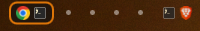
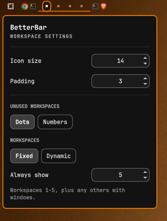

# BetterWorkspaces

A workspace widget for the Omarchy bar that shows the apps open on each workspace, based on the built-in Workspaces widget.



## What it does

- Shows an icon for each app open on a workspace, in the order the windows sit on screen (left to right).
- Puts a rounded border around the active workspace, using your theme's accent colour, so it follows theme changes.
- Shows a dot or a number for empty workspaces.
- Lists the window titles on a workspace when you hover it. Hovering also enlarges the workspace slightly and, if it isn't the active one, adds a soft glow in the accent colour.
- Switches to a workspace when you left-click it.
- Opens the settings menu when you right-click it.

## Install

```bash
omarchy plugin add https://github.com/SimonFrom/betterworkspaces.git --enable
```

Pick the **left** section when asked. Then remove the built-in Workspaces widget, so you don't have two:

```bash
omarchy plugin disable omarchy.workspaces
```

**Requirements:** Omarchy with Hyprland. Nothing else to install. The widget only runs `hyprctl` to switch workspaces. It makes no network requests and needs no extra permissions.

## Remove

```bash
omarchy plugin remove io.github.simonfrom.betterworkspaces
omarchy bar put omarchy.workspaces --section left
```

The second command puts the built-in Workspaces widget back.

## Settings

Right-click any workspace:



| Setting | What it does |
|---|---|
| Icon size | App icon size, 8–32px |
| Padding | Extra space either side of the icons inside the active border, 0–16px |
| Unused workspaces | Dots or numbers |
| Workspaces: Fixed | Always show workspaces 1–N, plus any others with windows |
| Workspaces: Dynamic | Only show workspaces with windows, plus the active one |
| Position | Left, center or right section of the bar (top, middle or bottom on a vertical bar), and first or last within that section |

Changes apply right away and are saved to `~/.config/omarchy/shell.json`.

These options are only available by editing the widget's entry in `shell.json`:

```json
{ "id": "io.github.simonfrom.betterworkspaces", "maxIcons": 4, "dedupe": true, "showIcons": true, "activeColor": "#ffffff" }
```

- `maxIcons`: the number of icons shown per workspace before it shows "+N".
- `dedupe`: when true, an app with several windows shows one icon.
- `showIcons`: turns app icons off entirely.
- `activeColor`: overrides the theme colour of the active border.

The settings menu can also be opened from a keybind: `omarchy-shell io.github.simonfrom.betterworkspaces toggle`.

## What it can't do

- It only shows workspaces 1–10. Special workspaces (the scratchpad) and named workspaces are not shown.
- Every monitor's bar shows the same workspaces. There's no per-monitor filtering.
- You can't drag icons to reorder them or move windows between workspaces.
- You can't click an icon to focus that window. A click switches to the workspace.
- Apps without a matching desktop entry or icon show a generic icon.
- The active border can't be taller than the bar. For more space above and below the icons, make the icons smaller.
- The settings apply to every bar. You can't give one monitor different settings from another.
- It only works with Hyprland.

## Troubleshooting

If a change to the plugin files doesn't appear in the bar, run `omarchy restart shell`.

## License

MIT. See [LICENSE](LICENSE). Based on the Omarchy Workspaces widget by David Heinemeier Hansson.
