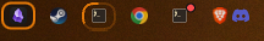
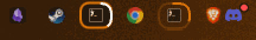
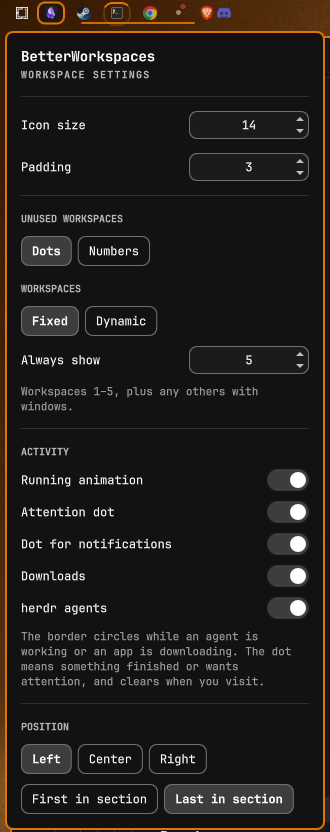

# BetterWorkspaces

A workspace widget for the Omarchy bar that shows the apps open on each workspace and what they're up to, based on the built-in Workspaces widget.



## What it does

- Shows an icon for each app open on a workspace, in the order the windows sit on screen (left to right).
- Puts a rounded border around the active workspace, using your theme's accent colour, so it follows theme changes.
- Animates a workspace's border while something there is running: a download, an AI agent working, or a build (see [Activity](#activity)).
- Puts a small red dot on a workspace when something there finished or wants your attention.
- Shows a dot or a number for empty workspaces.
- Lists the window titles and current activity on a workspace when you hover it. Hovering also enlarges the workspace slightly and, if it isn't the active one, adds a soft glow in the accent colour.
- Switches to a workspace when you left-click it.
- Opens the settings menu when you right-click it.

## Install

```bash
omarchy plugin add https://github.com/SimonFrom/betterworkspaces.git --enable
```

Pick the **left** section when asked. Then remove the built-in Workspaces widget, so you don't have two:

```bash
omarchy plugin disable omarchy.workspaces
```

**Requirements:** Omarchy with Hyprland. Nothing else to install. [herdr](https://herdr.dev) is optional; if it's running, agent status is picked up automatically.

## Update

```bash
omarchy plugin update io.github.simonfrom.betterworkspaces
```

If the bar doesn't change afterwards, run `omarchy restart shell`.

## Remove

```bash
omarchy plugin remove io.github.simonfrom.betterworkspaces
omarchy bar put omarchy.workspaces --section left
```

The second command puts the built-in Workspaces widget back.

## Activity



**Running.** A short dash circles the workspace border while something there is busy. On the active workspace the dash is white, so it shows against the accent border. On other workspaces it's in the accent colour. Hover the workspace to see what's running:

| Tooltip | When |
|---|---|
| Downloading · 50 MB/s | An app is writing to disk while receiving over the network, like a Steam download |
| Running | An app is writing heavily to disk without network traffic (a build, an install), or a window title starts with a spinner, as Claude Code's does while it works |
| 1 agent running | A [herdr](https://herdr.dev) agent is working. It counts towards the workspace holding the herdr terminal |

**Attention dot.** A small red dot appears on a workspace when:

- a download, build or spinner there finishes while you're on another workspace,
- a notification arrives from an app there,
- an app there asks Hyprland for attention,
- a herdr agent finishes or needs input.

The dot clears when you visit the workspace. herdr's dots clear when you view that agent in herdr.

**How it's measured.** Every 1.5 seconds the widget runs `disk-activity.sh`, which reads each app's bytes written to disk from `/proc` and bytes received from `ss`. An app counts as running once it writes more than 1 MB/s for about 4.5 seconds, and stops after about 6 seconds below that. If it's also receiving more than 256 KB/s it's labelled a download. When herdr is running, it also reads `herdr api snapshot`. Nothing needs root, and the widget makes no network requests.

## Settings

Right-click any workspace:



| Setting | What it does |
|---|---|
| Icon size | App icon size, 8–32px |
| Padding | Extra space either side of the icons inside the active border, 0–16px |
| Unused workspaces | Dots or numbers |
| Workspaces: Fixed | Always show workspaces 1–N, plus any others with windows |
| Workspaces: Dynamic | Only show workspaces with windows, plus the active one |
| Running animation | The circling border |
| Attention dot | The red dot |
| Dot for notifications | Whether notifications raise the dot |
| Downloads | Watch disk and network activity. Off means only agents and spinners animate |
| herdr agents | Read agent status from herdr |
| Position | Left, center or right section of the bar (top, middle or bottom on a vertical bar), and first or last within that section |

Changes apply right away and are saved to `~/.config/omarchy/shell.json`.

These options are only available by editing the widget's entry in `shell.json`:

```json
{ "id": "io.github.simonfrom.betterworkspaces", "maxIcons": 4, "dedupe": true, "showIcons": true, "activeColor": "#ffffff", "badgeColor": "#ff4d4f" }
```

- `maxIcons`: the number of icons shown per workspace before it shows "+N".
- `dedupe`: when true, an app with several windows shows one icon.
- `showIcons`: turns app icons off entirely.
- `activeColor`: overrides the theme colour of the active border.
- `badgeColor`: the colour of the attention dot.

The settings menu can also be opened from a keybind: `omarchy-shell io.github.simonfrom.betterworkspaces toggle`.

## What it can't do

- It only shows workspaces 1–10. Special workspaces (the scratchpad) and named workspaces are not shown.
- Every monitor's bar shows the same workspaces. There's no per-monitor filtering.
- You can't drag icons to reorder them or move windows between workspaces.
- You can't click an icon to focus that window. A click switches to the workspace.
- Apps without a matching desktop entry or icon show a generic icon.
- The active border can't be taller than the bar. For more space above and below the icons, make the icons smaller.
- The settings apply to every bar. You can't give one monitor different settings from another.
- Downloads slower than 1 MB/s aren't detected. Browser downloads over QUIC animate but say "Running", since only TCP traffic is counted.
- Activity is measured per app, not per window. Two windows of the same browser on different workspaces animate together, and so do two terminals showing the same herdr session.
- Notifications are matched to windows by app name, so an app whose notifications use a different name than its window won't raise a dot.
- It only works with Hyprland.

## Troubleshooting

If a change to the plugin files doesn't appear in the bar, run `omarchy restart shell`.

## Development

| File | What it holds |
|---|---|
| `BetterWorkspaces.qml` | The entry point: settings, workspace and icon lookups, layout |
| `WorkspaceButton.qml` | One workspace: icons, active border, running dash, attention dot, tooltip |
| `SettingsMenu.qml` | The right-click menu |
| `ActivityTracker.qml` | Running and attention state from herdr, disk activity, notifications and Hyprland |
| `Windows.js`, `AppIcons.js`, `Activity.js` | Pure logic with no QML dependencies |
| `disk-activity.sh` | Per-app disk and network byte counts |

The `.js` files are tested with Node's built-in test runner (Node 18 or newer):

```bash
node --test 'tests/*.test.mjs'
```

After changing a `.qml` file, run `omarchy restart shell`. Hot reload can keep serving a cached copy of `WorkspaceButton`, `SettingsMenu` or `ActivityTracker`.

## License

MIT. See [LICENSE](LICENSE). Based on the Omarchy Workspaces widget by David Heinemeier Hansson.
